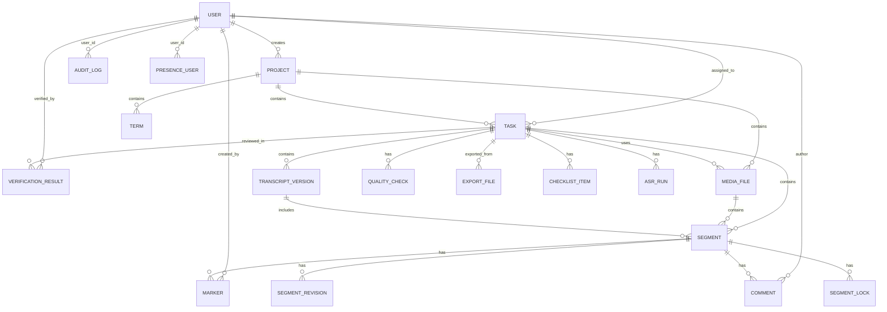

# PurrScription Data Model

## Entity-Relationship Diagram (ERD)



## Tables & Schema

### USER
User accounts with role-based access.

```sql
CREATE TABLE "user" (
    id UUID PRIMARY KEY DEFAULT gen_random_uuid(),
    email VARCHAR(255) NOT NULL UNIQUE,
    name VARCHAR(255) NOT NULL,
    password_hash VARCHAR(255) NOT NULL,
    role VARCHAR(50) NOT NULL,
    created_at TIMESTAMP NOT NULL DEFAULT CURRENT_TIMESTAMP,
    updated_at TIMESTAMP NOT NULL DEFAULT CURRENT_TIMESTAMP,
    
    CHECK (role IN ('admin', 'supervisor', 'annotator', 'verifier', 'ml_engineer', 'customer'))
);

CREATE INDEX idx_user_email ON "user"(email);
CREATE INDEX idx_user_role ON "user"(role);
```

### PROJECT
Container for tasks and media files.

```sql
CREATE TABLE project (
    id UUID PRIMARY KEY DEFAULT gen_random_uuid(),
    name VARCHAR(255) NOT NULL,
    description TEXT,
    created_by UUID NOT NULL REFERENCES "user"(id) ON DELETE RESTRICT,
    created_at TIMESTAMP NOT NULL DEFAULT CURRENT_TIMESTAMP,
    updated_at TIMESTAMP NOT NULL DEFAULT CURRENT_TIMESTAMP
);

CREATE INDEX idx_project_created_by ON project(created_by);
CREATE INDEX idx_project_created_at ON project(created_at DESC);
```

### MEDIA_FILE
Audio/video file metadata.

```sql
CREATE TABLE media_file (
    id UUID PRIMARY KEY DEFAULT gen_random_uuid(),
    project_id UUID NOT NULL REFERENCES project(id) ON DELETE CASCADE,
    name VARCHAR(255) NOT NULL,
    mime_type VARCHAR(100) NOT NULL,
    duration FLOAT NOT NULL,
    sampling_rate INTEGER NOT NULL,
    channels INTEGER NOT NULL DEFAULT 1,
    file_size BIGINT NOT NULL,
    storage_key VARCHAR(512) NOT NULL UNIQUE,
    uploaded_by UUID NOT NULL REFERENCES "user"(id) ON DELETE RESTRICT,
    uploaded_at TIMESTAMP NOT NULL DEFAULT CURRENT_TIMESTAMP,
    
    CHECK (duration > 0)
);

CREATE INDEX idx_media_file_project_id ON media_file(project_id);
CREATE INDEX idx_media_file_uploaded_by ON media_file(uploaded_by);
```

### TASK
Annotation task with workflow status.

```sql
CREATE TABLE task (
    id UUID PRIMARY KEY DEFAULT gen_random_uuid(),
    project_id UUID NOT NULL REFERENCES project(id) ON DELETE CASCADE,
    name VARCHAR(255) NOT NULL,
    status VARCHAR(50) NOT NULL DEFAULT 'new',
    media_file_id UUID NOT NULL REFERENCES media_file(id) ON DELETE RESTRICT,
    assigned_to UUID REFERENCES "user"(id) ON DELETE SET NULL,
    created_by UUID NOT NULL REFERENCES "user"(id) ON DELETE RESTRICT,
    created_at TIMESTAMP NOT NULL DEFAULT CURRENT_TIMESTAMP,
    updated_at TIMESTAMP NOT NULL DEFAULT CURRENT_TIMESTAMP,
    completed_at TIMESTAMP,
    
    CHECK (status IN ('new', 'assigned', 'in_progress', 'review', 'rework', 'fixed', 'accepted', 'exported'))
);

CREATE INDEX idx_task_project_id ON task(project_id);
CREATE INDEX idx_task_assigned_to ON task(assigned_to);
CREATE INDEX idx_task_status ON task(status);
CREATE INDEX idx_task_created_by ON task(created_by);
```

### SEGMENT (Core)
Temporal annotation unit with optimistic concurrency.

```sql
CREATE TABLE segment (
    id UUID PRIMARY KEY DEFAULT gen_random_uuid(),
    task_id UUID NOT NULL REFERENCES task(id) ON DELETE CASCADE,
    start_seconds FLOAT NOT NULL,
    end_seconds FLOAT NOT NULL,
    text TEXT DEFAULT '',
    speaker VARCHAR(100),
    confidence FLOAT DEFAULT 0.0,
    status VARCHAR(50) DEFAULT 'pending',
    version INTEGER NOT NULL DEFAULT 1,
    updated_at TIMESTAMP NOT NULL DEFAULT CURRENT_TIMESTAMP,
    updated_by UUID NOT NULL REFERENCES "user"(id) ON DELETE RESTRICT,
    
    CHECK (start_seconds >= 0),
    CHECK (end_seconds > start_seconds),
    CHECK (confidence >= 0.0 AND confidence <= 1.0),
    CHECK (status IN ('pending', 'annotated', 'verified', 'conflicted')),
    CHECK (version > 0)
);

CREATE INDEX idx_segment_task_id ON segment(task_id, status);
CREATE INDEX idx_segment_updated_at ON segment(updated_at DESC);
CREATE INDEX idx_segment_confidence ON segment(confidence) WHERE confidence < 0.8;
```

### SEGMENT_REVISION
Audit trail for segment changes.

```sql
CREATE TABLE segment_revision (
    id UUID PRIMARY KEY DEFAULT gen_random_uuid(),
    segment_id UUID NOT NULL REFERENCES segment(id) ON DELETE CASCADE,
    version INTEGER NOT NULL,
    text TEXT,
    speaker VARCHAR(100),
    start_seconds FLOAT NOT NULL,
    end_seconds FLOAT NOT NULL,
    confidence FLOAT,
    changed_by UUID NOT NULL REFERENCES "user"(id) ON DELETE RESTRICT,
    changed_at TIMESTAMP NOT NULL DEFAULT CURRENT_TIMESTAMP,
    
    UNIQUE(segment_id, version)
);

CREATE INDEX idx_segment_revision_segment_id ON segment_revision(segment_id);
```

### SEGMENT_LOCK
Manages focus, text, and boundary locks.

```sql
CREATE TABLE segment_lock (
    id UUID PRIMARY KEY DEFAULT gen_random_uuid(),
    segment_id UUID NOT NULL REFERENCES segment(id) ON DELETE CASCADE,
    user_id UUID NOT NULL REFERENCES "user"(id) ON DELETE CASCADE,
    lock_type VARCHAR(50) NOT NULL,
    acquired_at TIMESTAMP NOT NULL DEFAULT CURRENT_TIMESTAMP,
    expires_at TIMESTAMP NOT NULL,
    
    CHECK (lock_type IN ('focus', 'text', 'boundaries')),
    UNIQUE(segment_id, lock_type)
);

CREATE INDEX idx_segment_lock_expires_at ON segment_lock(expires_at);
```

### MARKER
Quality issues and annotations.

```sql
CREATE TABLE marker (
    id UUID PRIMARY KEY DEFAULT gen_random_uuid(),
    segment_id UUID NOT NULL REFERENCES segment(id) ON DELETE CASCADE,
    type VARCHAR(100) NOT NULL,
    severity VARCHAR(50) NOT NULL,
    status VARCHAR(50) NOT NULL DEFAULT 'open',
    description TEXT,
    created_by UUID NOT NULL REFERENCES "user"(id) ON DELETE RESTRICT,
    created_at TIMESTAMP NOT NULL DEFAULT CURRENT_TIMESTAMP,
    resolved_by UUID REFERENCES "user"(id) ON DELETE SET NULL,
    resolved_at TIMESTAMP,
    resolution TEXT,
    
    CHECK (severity IN ('info', 'warning', 'error', 'critical')),
    CHECK (status IN ('open', 'resolved', 'rejected'))
);

CREATE INDEX idx_marker_segment_id ON marker(segment_id);
CREATE INDEX idx_marker_status ON marker(status);
CREATE INDEX idx_marker_severity ON marker(severity);
CREATE INDEX idx_marker_created_at ON marker(created_at DESC);
```

### COMMENT
Discussion and feedback on segments.

```sql
CREATE TABLE comment (
    id UUID PRIMARY KEY DEFAULT gen_random_uuid(),
    segment_id UUID NOT NULL REFERENCES segment(id) ON DELETE CASCADE,
    text TEXT NOT NULL,
    author UUID NOT NULL REFERENCES "user"(id) ON DELETE RESTRICT,
    created_at TIMESTAMP NOT NULL DEFAULT CURRENT_TIMESTAMP,
    updated_at TIMESTAMP NOT NULL DEFAULT CURRENT_TIMESTAMP,
    resolved BOOLEAN NOT NULL DEFAULT FALSE
);

CREATE INDEX idx_comment_segment_id ON comment(segment_id);
CREATE INDEX idx_comment_author ON comment(author);
CREATE INDEX idx_comment_resolved ON comment(resolved);
```

### TRANSCRIPT_VERSION
Immutable snapshot of all segments at a point in time.

```sql
CREATE TABLE transcript_version (
    id UUID PRIMARY KEY DEFAULT gen_random_uuid(),
    task_id UUID NOT NULL REFERENCES task(id) ON DELETE CASCADE,
    version INTEGER NOT NULL,
    segments JSONB NOT NULL,
    created_by UUID NOT NULL REFERENCES "user"(id) ON DELETE RESTRICT,
    created_at TIMESTAMP NOT NULL DEFAULT CURRENT_TIMESTAMP,
    
    UNIQUE(task_id, version)
);

CREATE INDEX idx_transcript_version_task_id ON transcript_version(task_id);
```

### TERM
Project glossary.

```sql
CREATE TABLE term (
    id UUID PRIMARY KEY DEFAULT gen_random_uuid(),
    project_id UUID NOT NULL REFERENCES project(id) ON DELETE CASCADE,
    text VARCHAR(255) NOT NULL,
    translation TEXT,
    context TEXT,
    created_by UUID NOT NULL REFERENCES "user"(id) ON DELETE RESTRICT,
    created_at TIMESTAMP NOT NULL DEFAULT CURRENT_TIMESTAMP,
    
    UNIQUE(project_id, text)
);

CREATE INDEX idx_term_project_id ON term(project_id);
```

### CHECKLIST_ITEM
Pre-export validation checklist.

```sql
CREATE TABLE checklist_item (
    id UUID PRIMARY KEY DEFAULT gen_random_uuid(),
    task_id UUID NOT NULL REFERENCES task(id) ON DELETE CASCADE,
    description TEXT NOT NULL,
    required BOOLEAN NOT NULL DEFAULT TRUE,
    completed BOOLEAN NOT NULL DEFAULT FALSE,
    completed_by UUID REFERENCES "user"(id) ON DELETE SET NULL,
    completed_at TIMESTAMP
);

CREATE INDEX idx_checklist_item_task_id ON checklist_item(task_id);
CREATE INDEX idx_checklist_item_completed ON checklist_item(completed);
```

### QUALITY_CHECK
Automated validation results.

```sql
CREATE TABLE quality_check (
    id UUID PRIMARY KEY DEFAULT gen_random_uuid(),
    task_id UUID NOT NULL REFERENCES task(id) ON DELETE CASCADE,
    check_type VARCHAR(100) NOT NULL,
    severity VARCHAR(50) NOT NULL,
    message TEXT NOT NULL,
    passed BOOLEAN NOT NULL,
    details JSONB,
    run_at TIMESTAMP NOT NULL DEFAULT CURRENT_TIMESTAMP,
    
    CHECK (severity IN ('info', 'warning', 'error', 'critical'))
);

CREATE INDEX idx_quality_check_task_id ON quality_check(task_id);
CREATE INDEX idx_quality_check_passed ON quality_check(passed);
CREATE INDEX idx_quality_check_severity ON quality_check(severity);
```

### VERIFICATION_RESULT
Verifier's approval/rejection.

```sql
CREATE TABLE verification_result (
    id UUID PRIMARY KEY DEFAULT gen_random_uuid(),
    task_id UUID NOT NULL REFERENCES task(id) ON DELETE CASCADE,
    verified_by UUID NOT NULL REFERENCES "user"(id) ON DELETE RESTRICT,
    result VARCHAR(50) NOT NULL,
    comment TEXT,
    verified_at TIMESTAMP NOT NULL DEFAULT CURRENT_TIMESTAMP,
    
    CHECK (result IN ('accepted', 'rejected', 'rework'))
);

CREATE INDEX idx_verification_result_task_id ON verification_result(task_id);
CREATE INDEX idx_verification_result_verified_by ON verification_result(verified_by);
```

### EXPORT_FILE
Immutable export artifact.

```sql
CREATE TABLE export_file (
    id UUID PRIMARY KEY DEFAULT gen_random_uuid(),
    task_id UUID NOT NULL REFERENCES task(id) ON DELETE CASCADE,
    format VARCHAR(50) NOT NULL,
    storage_key VARCHAR(512) NOT NULL UNIQUE,
    file_size BIGINT NOT NULL,
    checksum VARCHAR(64) NOT NULL UNIQUE,
    exported_by UUID NOT NULL REFERENCES "user"(id) ON DELETE RESTRICT,
    exported_at TIMESTAMP NOT NULL DEFAULT CURRENT_TIMESTAMP,
    quality_gate_passed BOOLEAN NOT NULL,
    
    CHECK (format IN ('json', 'vtt', 'srt', 'txt'))
);

CREATE INDEX idx_export_file_task_id ON export_file(task_id);
CREATE INDEX idx_export_file_exported_by ON export_file(exported_by);
```

### ASR_RUN
ML model execution metadata.

```sql
CREATE TABLE asr_run (
    id UUID PRIMARY KEY DEFAULT gen_random_uuid(),
    task_id UUID NOT NULL REFERENCES task(id) ON DELETE CASCADE,
    model VARCHAR(100) NOT NULL,
    version VARCHAR(50) NOT NULL,
    device VARCHAR(50) NOT NULL,
    status VARCHAR(50) NOT NULL DEFAULT 'pending',
    started_at TIMESTAMP NOT NULL DEFAULT CURRENT_TIMESTAMP,
    completed_at TIMESTAMP,
    error TEXT,
    
    CHECK (status IN ('pending', 'running', 'completed', 'failed'))
);

CREATE INDEX idx_asr_run_task_id ON asr_run(task_id);
CREATE INDEX idx_asr_run_status ON asr_run(status);
```

### PRESENCE_USER
Real-time user presence (WebSocket).

```sql
CREATE TABLE presence_user (
    id UUID PRIMARY KEY DEFAULT gen_random_uuid(),
    user_id UUID NOT NULL REFERENCES "user"(id) ON DELETE CASCADE,
    task_id UUID NOT NULL REFERENCES task(id) ON DELETE CASCADE,
    last_seen_at TIMESTAMP NOT NULL DEFAULT CURRENT_TIMESTAMP,
    status VARCHAR(50) NOT NULL DEFAULT 'active',
    
    CHECK (status IN ('active', 'idle', 'disconnected')),
    UNIQUE(user_id, task_id)
);

CREATE INDEX idx_presence_user_task_id ON presence_user(task_id);
CREATE INDEX idx_presence_user_last_seen_at ON presence_user(last_seen_at);
```

### AUDIT_LOG
Immutable activity trail.

```sql
CREATE TABLE audit_log (
    id UUID PRIMARY KEY DEFAULT gen_random_uuid(),
    action VARCHAR(100) NOT NULL,
    entity_type VARCHAR(100) NOT NULL,
    entity_id VARCHAR(255) NOT NULL,
    user_id UUID NOT NULL REFERENCES "user"(id) ON DELETE RESTRICT,
    timestamp TIMESTAMP NOT NULL DEFAULT CURRENT_TIMESTAMP,
    details JSONB,
    
    UNIQUE(entity_type, entity_id, timestamp, user_id)
);

CREATE INDEX idx_audit_log_entity ON audit_log(entity_type, entity_id);
CREATE INDEX idx_audit_log_user_id ON audit_log(user_id);
CREATE INDEX idx_audit_log_timestamp ON audit_log(timestamp DESC);
```

## Key Constraints

| Constraint | Table | Description |
|-----------|-------|-------------|
| Optimistic Concurrency | segment | `version` field prevents lost updates |
| Unique Lock Per Segment | segment_lock | Only one text/boundaries lock per segment |
| Workflow Status | task | Enum + transitions (new → assigned → in_progress → review → ...) |
| Soft Deletes | None | Hard deletes (ON DELETE CASCADE) for data integrity |
| Foreign Keys | All | Referential integrity via FK + ON DELETE rules |
| Check Constraints | All | Domain validation (e.g., status enums, duration > 0) |

## Migrations

Migrations are auto-generated via Alembic:

```bash
cd apps/api
alembic revision --autogenerate -m "add segment_lock table"
alembic upgrade head
```

All migrations are idempotent and reversible.

## Indexes

Indexes optimized for common query patterns:

| Query | Index |
|-------|-------|
| Get all segments in task | `segment(task_id, status)` |
| Recent segment updates | `segment(updated_at DESC)` |
| Filter tasks by status | `task(status)` |
| Find open markers | `marker(status)` WHERE severity IN (...) |
| User's audit trail | `audit_log(user_id, timestamp DESC)` |

## Scaling Considerations

1. **Partitioning**: Consider partitioning `segment`, `marker`, `comment`, `audit_log` by `task_id` for very large tasks (100k+ segments)
2. **Archiving**: Archive old export files and audit logs to S3 after 90 days
3. **Materialized Views**: For analytics (task completion rate, marker distribution)
4. **Read Replicas**: For read-heavy API routes (GET projects, GET tasks list)
